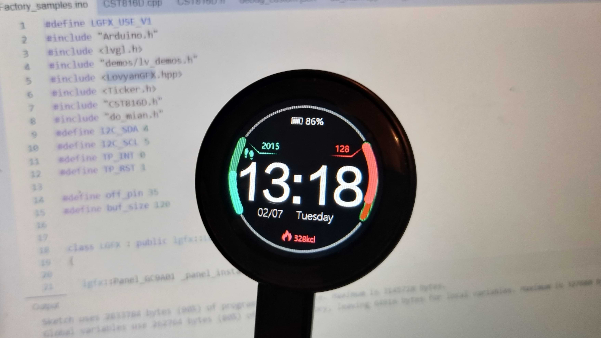

# Getting started with ESP32 LVGL for Arduino Development Board 1.28 Inch 240*240 IPS Smart Display Screen LCD TFT Module WiFi & Bluetooth with Touch

I recently bought this ESP32-C3 board with a round LCD TFT display and struggled for a while to start programming it with Arduino. I'm documenting the steps to get the demo app compiled and uploaded here, to save the other happy owners some time.   

## Version of Arduino

1. Use Arduino 2.2.1

## Demo examples

2. Download and expand demo examples: [http://pan.jczn1688.com/directlink/1/ESP32%20module/1.28inch_ESP32-2424S012.zip](http://pan.jczn1688.com/directlink/1/ESP32%20module/1.28inch_ESP32-2424S012.zip)

3. Open directory 1.28inch_ESP32-2424S012 (1)\1.28inch_ESP32-2424S012\1-Demo\Demo_Arduino\1_1_Factory_samples\Factory_samples

4. Open Factory_samples.ino sketch

## Board and Partition scheme 

5. Select Adafruit QT Py ESP32-C3 board 

6. Select Huge APP partition scheme

## Libraries

8. Install LovyanGFX library

## Fix the lvgl bug

9. Fix lvgl library bug: [https://github.com/lvgl/lvgl/issues/3851](https://github.com/lvgl/lvgl/issues/3851)

by removing definition #define LV_USE_FS_FATFS 1 in .../Arduino/libraries/lvgl/src/extra/libs/fsdrv/lv_fs_fatfs.c

## Compile and upload the sketch

